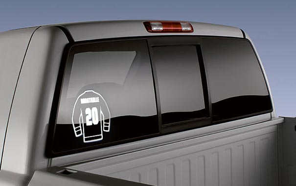
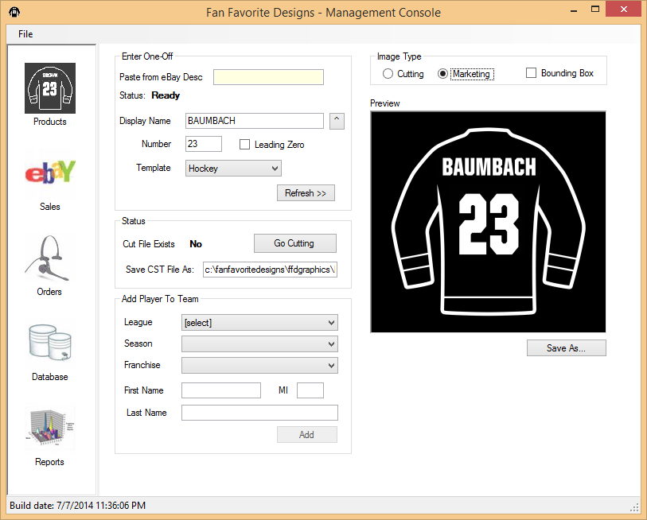
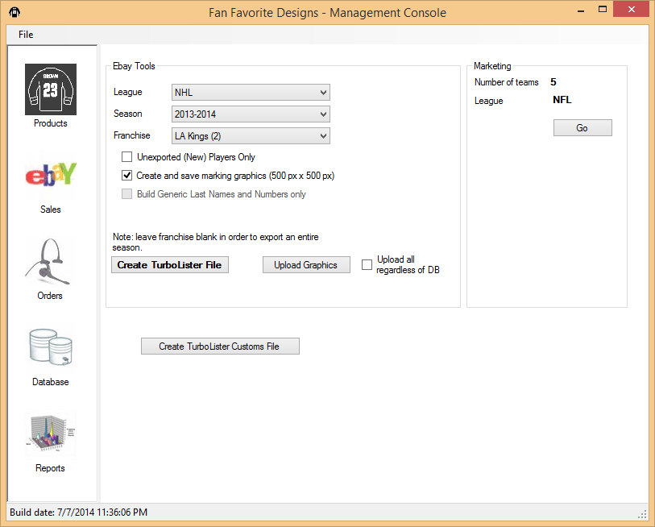
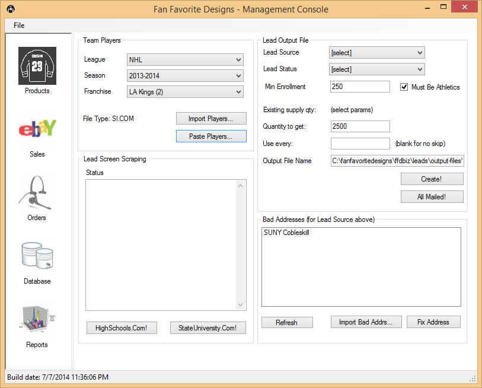
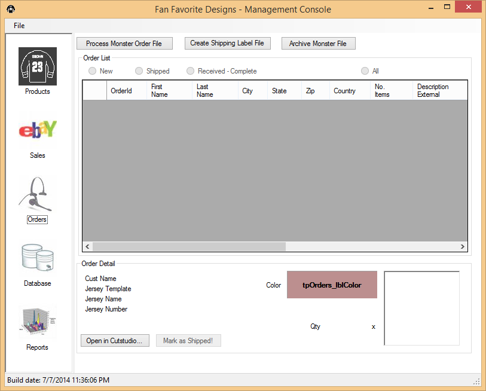
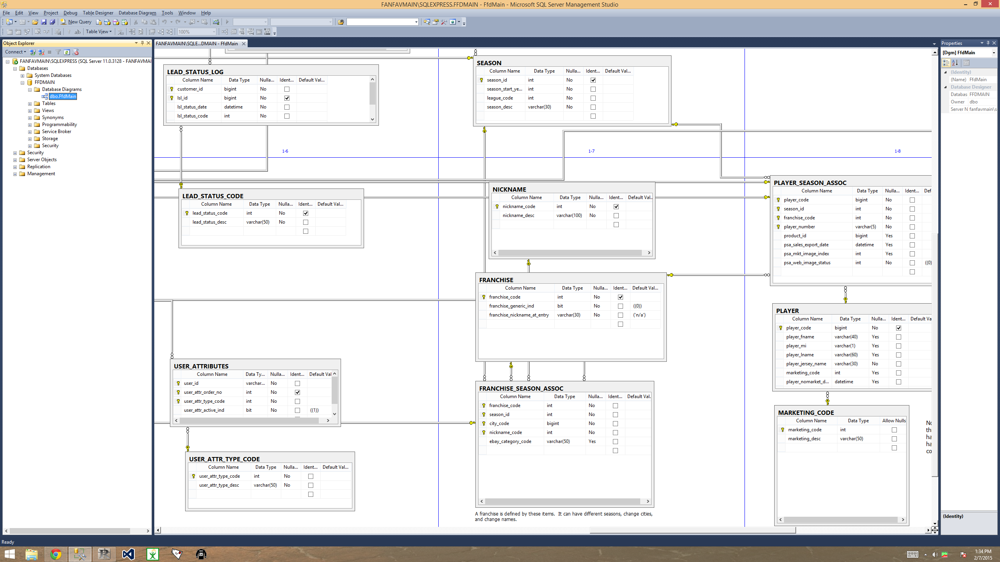

FanFavoriteDesigns
==================

Way back in 2001, this company made white vinyl window stickers of your favorite sports hero.  The sticker was in the outline of a jersey, like a hockey jersey, with a name and number.  So, this:

The stickers are made with a vinyl cutting machine (I used Roland Stika SV-8s), and passing it a special plotter file describing what the sticker looks like.  The trick is creating the plotter file cheaply.  By hand, it would take a really long time to create a sticker for every player in the NHL, NBA, NFL, and MLB leagues.  Also, each custom sticker would have to be created by hand.  Unless you're a huge company making large quantities, this is expensive and prohibitively time consuming.  This company had a grand total of 1 staffer (me)!

The solution, of course, is a software application!  That's why you're here, right?  Our program automates all these things:

* Scrape the data for all the players in the pro and college leagues from the web
* Export all the listings (with a picture) to an ebay-compatible data file for upload
* Sending the plotter file to the Stika cutting machines
* Printing shipping labels via USPS
* Tracking custom orders from the e-commerce site
* Preview a custom sticker on the e-commerce site via iframe
* Generate CSV lead file for sending marketing postcards
* Save all this stuff in a Microsft SQL Server database

This is the source code of the backoffice application that does all these things.  It may be helpful for someone someday.

Screenshots
-----------

They say a picture is worth a thousand words.  So, without further ado... 

<table cellpadding="10">

<tr>
<td width="600"></td>
<td>The main screen of the app, allowing you to import/export data and generate a picture or a plotter file of a sticker.</td>
</tr>

<tr>
<td></td>
<td>The ebay screen where you can generate some or all of the listings.</td>
</tr>

<tr>
<td></td>
<td>From here you can import team player listings or generate a CSV file for mailing out marketing postcards to highschools.</td>
</tr>

<tr>
<td></td>
<td>For the e-commerce site hosted on "Monster Commerce", this screen would import all the custom orders and save them in the database for printing and shipping.</td>
</tr>

<tr>
<td></td>
<td>A screenshot of a portion of the database in SQL Management Studio.</td>
</tr>

</table>

